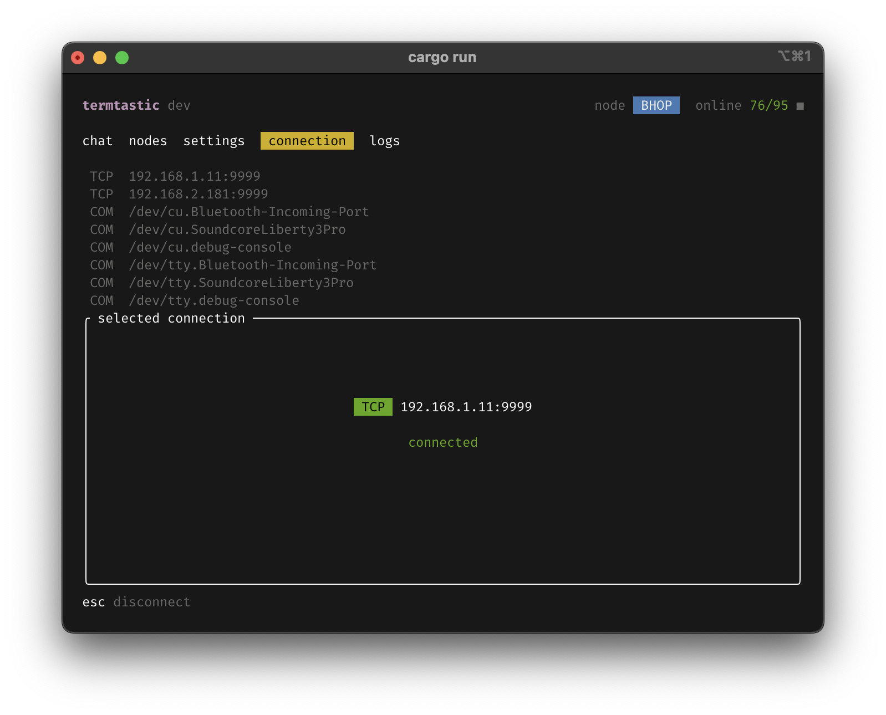

<p align="center"></p>

<p align="center">
  <b>termtastic</b> is a feature-rich handmade <a href="https://meshtastic.org">Meshtastic®</a> console client written in Rust.
</p>

<p align="center">
  <a href="https://github.com/acelot/termtastic/actions"></a>
  <a href="./LICENSE"></a>
  <a href="https://meshtastic.org"></a>
</p>

<table>
  <tr>
    <td></td>
    <td></td>
  </tr>
  <tr>
    <td></td>
    <td></td>
  </tr>
</table>

| :warning: WARNING                                                                       |
| :-------------------------------------------------------------------------------------- |
| Project is under active development, things could be changed completely without notice. |

## Features

> [!NOTE]  
> Unchecked items are not implemented yet.

### Chat tab
- Channels
  - [x] Scrollable channels list (Primary, Secondary)
  - [x] Direct conversations
  - [x] Display the last message for each channel
- Messenger
  - [x] Scrollable chat screen
  - [x] Display the short and long names of node
  - [x] Display the SNR/RSSI for direct nodes 
  - [x] Display the number of hops for retranslated messages
  - [x] Display the time of messages
  - [x] Display the reactions (emojis) 
  - [ ] Ability to see reactions details
  - [x] Ability to send broadcast messages to the channels
  - [x] Ability to send direct messages to the nodes
  - [x] Ability to reply to the messages
  - [x] Ability to send the reactions (emojis)
  - [x] Limiting the message length to 200 chars (with counter)

### Nodes tab
- Nodes list
  - [x] Scrollable nodes list
  - [x] Ability to start direct conversation with selected node
  - [x] Display the short and long names of node
  - [x] Display the SNR/RSSI for direct nodes 
  - [x] Display the number of hops for the routed nodes
  - [x] Display the ID of the nodes
  - [x] Display the humanized last heard time of the nodes
  - [ ] Sort nodes by different fields: last heard, hops count, distance, etc
  - [ ] Nodes fuzzy search
- Single node expanded view
  - [ ] Display node detailed info
  - [ ] Traceroute feature
  - [ ] Ignore feature
  - [ ] TBD

### Settings tab
- [x] Loading device configuration (generic feature)s
- [x] Saving device configuration (generic feature)
- Radio
  - [x] LoRa
  - [ ] Channels
  - [ ] Security
- Device
  - [x] User
  - [x] Device
  - [ ] Position
  - [ ] Power
  - [ ] Display
  - [ ] Bluetooth
- Module
  - [ ] MQTT
  - [ ] Serial
  - [ ] External Notification
  - [ ] Store & Forward
  - [ ] Range Test
  - [ ] Telemetry
  - [ ] Canned Message
  - [ ] Neighbor Info
- App
  - [ ] UI

### Connection tab
- [x] Scrollable devices list (TCP, BLE, Serial)
- [x] Connection via TCP
- [x] Connection via BLE
- [x] Connection via Serial
- [x] Device configuration loading during connection process and storing it into state
- [x] Storing TCP connections into config file
- [x] Discovering of BLE and Serial devices feature
- [x] Reconnection feature with exponential backoff timeouts 

### Logs tab
- [x] Writing logs into files using daily rolling strategy
- [x] Mirroring logs into log list with scroll
- [x] Ability to expand the single log record (useful for long logs)
- [x] Ability to copy log record into clipboard

### General features
- [x] RX indicator
- [x] Online/Total nodes counter 

## Stack

| Feature                     | Library                                                         |
| :-------------------------- | :-------------------------------------------------------------- |
| TUI: Framework              | [Ratatui](https://ratatui.rs)                                   |
| TUI: Backend                | [crossterm](https://github.com/crossterm-rs/crossterm)          |
| TUI: Inputs                 | [ratatui-textarea](https://github.com/ratatui/ratatui-textarea) |
| TUI: Lists                  | [tui-widget-list](https://github.com/preiter93/tui-widget-list) |
| Interaction with Meshtastic | [meshtastic](https://github.com/meshtastic/rust)                |
| Clipboard functionality     | [arboard](https://github.com/1Password/arboard)                 |
| Bluetooth devices discovery | [bluest](https://github.com/alexmoon/bluest/)                   |
| Logging                     | [tracing](https://github.com/tokio-rs/tracing)                  |
| Async/Channels              | [tokio](https://github.com/tokio-rs/tokio)                      |
| Configuration               | [confy](https://github.com/rust-cli/confy)                      |
| Errors                      | [anyhow](https://github.com/dtolnay/anyhow)                     |
| Datetime                    | [chrono](https://github.com/chronotope/chrono)                  |
| Emoji selector              | [emoji](https://github.com/Shizcow/emoji-rs)                    |

## Compatibility

✅ - tested, 🔬 - untested, ❌ - not working

| Feature                  | 🐧 Linux | 🍏 macOS | 🪟 Windows |
| :----------------------- | :-----: | :-----: | :-------: |
| BLE devices discovery    |    ✅    |    ✅    |     🔬     |
| Serial devices discovery |    ✅    |    ✅    |     ✅     |

## Download

| Source             | Link                                                      |
| :----------------- | :-------------------------------------------------------- |
| Manual download    | [Releases](https://github.com/acelot/termtastic/releases) |
| Debian PPA         | 🏗️ TBA                                                     |
| Arch Linux AUR     | 🏗️ TBA                                                     |
| macOS Brew         | 🏗️ TBA                                                     |
| Windows Chocolatey | 🏗️ TBA                                                     |

## FAQ

### How to launch manually downloaded app on macOS?

In order to run unsigned application on macOS you need dequarantine it using the command below:

```sh
xattr -d com.apple.quarantine ./path/to/termtastic
```