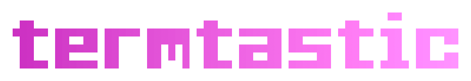
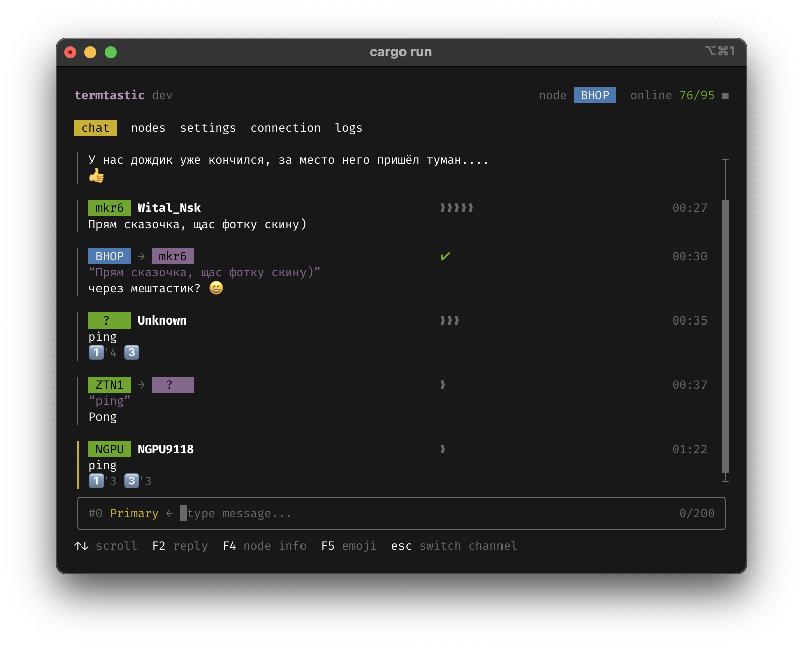
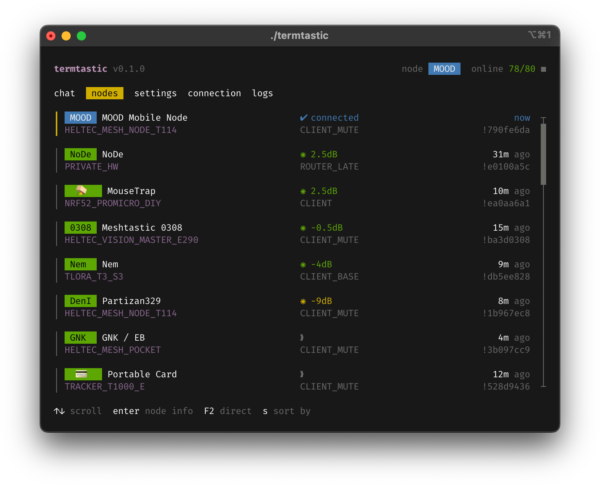
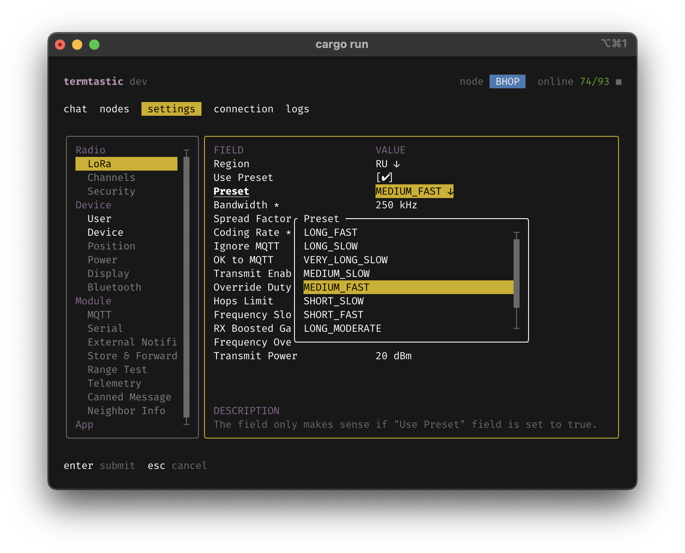

  <bold>termtastic</bold> is a feature-rich handmade <a href="https://meshtastic.org">Meshtastic®</a> console client written in Rust.

  
  

<table>
  <tr>
    <td></td>
    <td></td>
    <td></td>
  </tr>
</table>

# Features

# Compatibility

# Installation

# Roadmap

